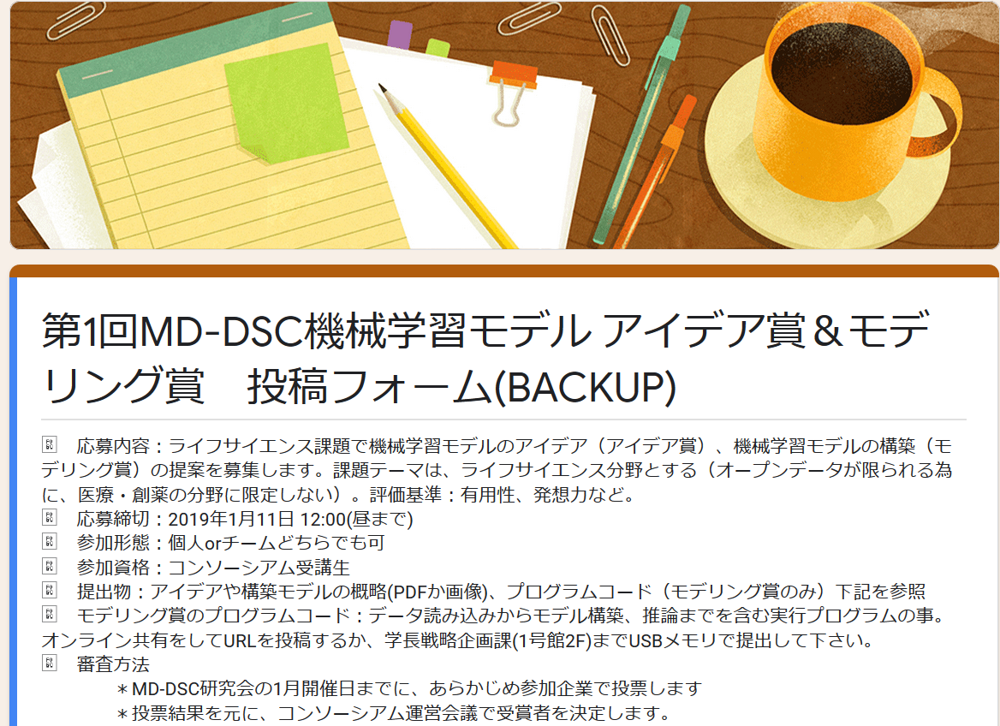

## MDDSC([医療・創薬データサイエンスコンソーシアム](http://md-dsc.com/))の2018年度教材
e-Learningシステム掲載のビデオ映像, MS Powerpointスライド, Google Colabのプログラム実習教材、を提供しています。
2018.4.1から2年間有効です。

- **[1]次世代シーケンサ解析第 1回 2018.7.4** [[目次](#NGS1)]
- **[2]次世代シーケンサ解析第 2回 2018.7.11** [[目次](#NGS2)]
- **[3]次世代シーケンサ解析第 3回 2018.8.1** [[目次](#NGS3)]
- **[4]Linux実習（必要により追加した実習）2018.11.27** [[目次](#LINUX)、Google Colab実習]
- **[5]2018年度 Amazon Web Service機械学習PBLセミナー アイデアソン　2018.11.7** [[開催報告](http://md-dsc.com/events/20181107event.php),[スライド](EK_AWSPBL181107.pdf)]
- **[6]第1回MDDSC機械学習コンペティション2019.1.22** [[開催報告](http://md-dsc.com/events/20190122event.php), Google Colab事例,[紹介スライド](MDDSC_MLコンペ紹介181228.pdf)]

----

## 経産未来の教室、BIスキル向上用教材「データサイエンティスト人材育成公開講座19-02」2019年2月

[経済産業省の未来の教室](https://www.learning-innovation.go.jp/verify-list/)（第4次産業革命の人材育成実証事業）に採択された日本バイオインフォマティクス学会、JBIC、日本オミックス医学会の支援により深層学習の前処理教材を作成しました。

講習タイトル：**深層学習による画像分類と前処理効果**
概要：オープンデータのマウスOCT画像を用いて、疾患と正常を分類する深層学習モデルを構築します。更に前処理の種類別の分類精度の変化を、Google ColabのPythonコードを追いながら解説します。
発展：アンケートの結果を基に、MDDSC2019年度の「深層学習の基礎技術」教材の一部として、本講習教材は発展的にまとめられました。

----
## 第1回MDDSC機械学習コンペティション

- インプリメント賞（モデリング賞）の為の事例用PythonプログラムをGoogle Colabで作成しました。
- 応募投稿フォームの画像キャプチャ

 
----
----

##　教材目次一覧

## NGS1 
-- 
## NGS2
-- 
## NGS3
-- 

----

##LINUX実習でのコマンドリスト・ファイル拡張子リスト

## LINUX
-- 
-- 
-- 
